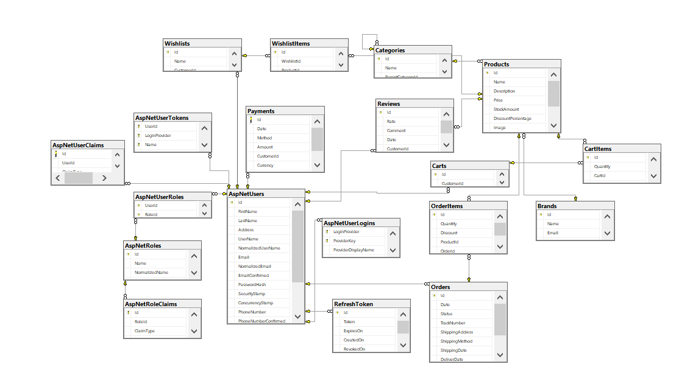

# E-Commerce_WebAPI
E-Commerce Restful API with .NET 8, utilizes AspNetCore.Identity for user management, Mailkit for email communication and Stripe payment integration. This API allow users to view products by categories and brand, manage carts, and complete purchases checkout.
## Contents
-  [Features](#features)
-  [Technologies](#technologies)
-  [Installation](#installation)
-  [Configuration](#configuration)
-  [Database Scheme](#database-scheme)
-  [Seeds](#seeds)

## Features
- User registeration and account management.
- Product listing and categorization by Category or Brand.
- Orders management.
- Cart and Shopping functionality.
- Wishlist management.
- Checkout and payment.
- Email communication.
## Technologies
- ASP .NET core 8 WebApi.
- AspNetCore.Identity: for authentication and authorization.
- EF core as ORM.
- SQL Server as DBMS.
- JWT: as token-based authentication.
- Stripe payment integration.
- Automapper:  For object-object mapping.
- DTOs: data transfer between layers.
- UnitOfWork & Repository pattern.
- Mailkit & Mimekit: for emails communication.
- Clean architecture.
## Installation
1- Clone the Repo:
  ```bash
  git clone https://github.com/mohdali300/E-Commerce_WebAPI
  ```
2- Install packages:
  ```bash
  git restore
  ```
## Configuration
Update the appsettings.json file with your own settings:
  ```json
     {
      "ConnectionStrings": {
        "DefaultConnection": "Data Source=.;Initial Catalog=E-CommerceApi;Integrated Security=True;Trust Server Certificate=True;"
      },
      "Logging": {
        "LogLevel": {
          "Default": "Information",
          "Microsoft.AspNetCore": "Warning"
        }
      },
      "AllowedHosts": "*",
      "JWT": {
        "Key": "PutYourSecretKeyHere",
        "Audience": "AppUser",
        "Issuer": "AuthUser"
      },
      "EmailSettings": {
        "Email": "example@gmail.com",
        "Password": "emailPassword",
        "Host": "smtp.gmail.com", //for gmail
        "DisplayName": "API Commerce",
        "Port": 587 //for gmail
      },
      "Stripe": {
        "PublishableKey": "pk_test_get_it_from_your_stripe_account",
        "SecretKey": "sk_test_get_it_from_your_stripe_account"
      }
    }
  ```
## Database Scheme


### Tables:
- ***Identity tables.***
- ***Product.***
- ***Category.***
- ***Brand.***
- ***Cart.***
- ***CartItems***: Link the Cart table with Product table.
- ***Order.***
- ***OrderItems***: Link the Order table with Product table.
- ***Wishlist.***
- ***WishlistItems***: Link the Wishlist table with Product table.
- ***Payment***: Contains payments the user has done and its methods.
- ***Review***: Contains users reviewsand rates for products.
- ***RefreshTokens***: Contains users refresh tokens.

## Seeds
Project contains data seeds as json files for `Products` `Orders` `Ctegories` `...etc` that will help you in testing endpoints.

---
Star it and feel free to ask, contribute and share it with others.
Thank you for checking out my project.
